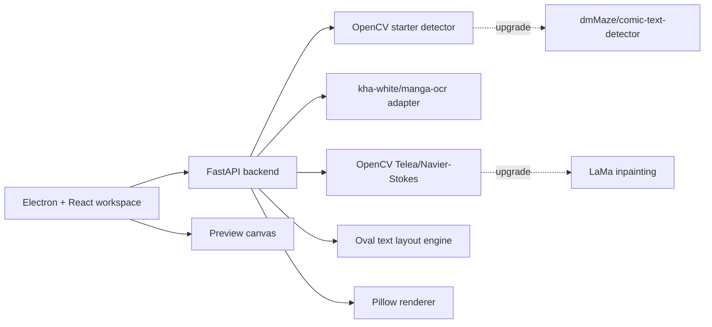

# ComicTrans

A local-first comic translation workspace scaffold with:

- Python/FastAPI backend for page analysis, OCR hooks, inpainting, and rendering.
- A tested Pillow-style oval text layout engine with binary-search font sizing.
- React/Electron desktop UI with a three-column canvas, dialogue editor, and live preview.
- Optional local model adapters instead of paid translation or OCR APIs.

## Architecture



## Backend

```bash
cd backend
python3 -m venv .venv
.venv/bin/pip install -r requirements.txt
.venv/bin/uvicorn manga_workspace.api:app --reload --host 127.0.0.1 --port 8000 --app-dir src
```

OCR is off by default in the UI because `manga-ocr` loads a PyTorch model. The API supports it with:

```http
POST /pages/analyze?runOcr=true
```

The intended automatic API flow is:

```text
POST /pages/process
```

with:

```text
runOcr=true
translate=true
includeImages=false
```

That endpoint uploads a page, detects bubbles, runs OCR for every detected bubble, translates every OCR result with local Ollama, renders the preview, and returns `previewUrl`.

The staged API flow is:

```text
POST /pages/analyze    -> returns detected bubbles with sourceText
POST /pages/translate  -> fills translation for every bubble that has sourceText
POST /pages/render     -> writes preview.png
GET  /pages/{pageId}/images/preview
```

Start Ollama before using translation:

```bash
ollama serve
ollama pull llama3
```

If you do not use Ollama, install the local Hugging Face translator:

```bash
cd backend
.venv/bin/pip install -r requirements-translate.txt
```

Then set `translationEngine=huggingface` or leave `translationEngine=auto`.

The backend now uses `comic-text-detector` when `backend/vendor/comic-text-detector` and `backend/models/comictextdetector.pt.onnx` are present. If those are missing, it falls back to the weaker OpenCV detector.

For manual testing in Swagger, turn off inline base64 images:

```http
POST /pages/analyze?runOcr=false&includeImages=false
```

That returns small image links such as `/pages/{pageId}/images/cleaned` instead of huge `data:image/png;base64,...` fields.

For a browser-extension style flow on raw manga pages, keep the default high-quality processing:

```http
POST /pages/process?runOcr=true&translate=true&includeImages=false
```

That keeps detection, OCR, translation, inpainting, and rendering in the normal pipeline while avoiding huge inline base64 image payloads.

Only for a quick detection/OCR preview where you intentionally do not need inpainting yet, skip cleaned image generation:

```http
POST /pages/analyze?runOcr=true&includeImages=false&cleanImage=false
```

That returns detected regions and OCR text, but avoids mask expansion, dark-text cleanup, and local-fill image writing. This is faster, but it is not the final quality path.

Install OCR support when you are ready for the heavier local model:

```bash
cd backend
.venv/bin/pip install -r requirements-ocr.txt
```

The first OCR run downloads/loads the model, so it can take a while. Smoke test OCR on a cropped text bubble:

```bash
cd backend
.venv/bin/python scripts/ocr_image.py /path/to/page.png --bbox 80,80,220,140
```

For a quick Phase 2 smoke test, draw text into one bubble:

```bash
cd backend
python scripts/draw_text.py page.png out.png "I made it fit!" --bbox 80,80,220,140 --tone shouting
```

To run the actual analyze + inpaint + render path and save a normal result image:

```bash
cd backend
.venv/bin/python scripts/preview_page.py /path/to/page.png /tmp/manga-preview.png --text "I MADE IT FIT!"
```

In Swagger, `POST /pages/render` accepts manual translation boxes. Use `baseImage: "original"` and
`replaceBackground: true` when the detector missed text and you want readable white English boxes:

```json
{
  "pageId": "YOUR_PAGE_ID",
  "baseImage": "original",
  "replaceBackground": true,
  "bubbles": [
    {
      "id": "manual-001",
      "bbox": { "x": 56, "y": 120, "width": 91, "height": 72 },
      "confidence": 1,
      "sourceText": "",
      "translation": "CHILDREN",
      "tone": "neutral"
    }
  ]
}
```

Then open `/pages/YOUR_PAGE_ID/images/preview`.

For the sample page you uploaded, copy the complete body from:

```text
backend/examples/full-page-render.json
```

## Desktop

```bash
cd desktop
npm install
npm run dev
```

Then open:

```text
http://127.0.0.1:5173
```

Electron is optional during early testing. Install and launch it from WSL2/Linux Node, or from a normal Windows path such as `C:\Users\buimi\dev\ComicTrans`, not from a `\\wsl.localhost\...` UNC path:

```bash
cd desktop
npm run electron:install
npm run electron
```

After Electron is installed, run Vite and Electron together:

```bash
npm run desktop
```

The UI expects the backend at `http://127.0.0.1:8000`; the toolbar field lets you change it.

## Chrome Extension

The extension lives in:

```text
extension/
```

It uses Manifest V3, a side panel for controls, and a content script that scans normal `http` and `https` pages for large manga-like images. The extension still uses the high-quality backend route:

```http
POST /pages/process?runOcr=true&translate=true&includeImages=false
```

Start the backend first:

```bash
cd backend
.venv/bin/uvicorn manga_workspace.api:app --host 127.0.0.1 --port 8000 --app-dir src
```

Then load the extension:

```text
1. Open chrome://extensions
2. Turn on Developer mode
3. Click Load unpacked
4. Select the extension/ directory
```

Use it on a raw manga page:

```text
1. Open the manga page in Chrome
2. Click the ComicTrans extension button to open the side panel
3. Click Refresh to scan page images
4. Click Translate on an image, or Visible to process visible images
```

The extension fetches the selected image, sends it to the local backend, and overlays the rendered translated preview on top of the original page image. Some sites protect image URLs with anti-hotlinking rules; those may need a site-specific fetch fallback later.

## Model Upgrade Paths

- Text detection: replace `OpenCVTextDetector` in `backend/src/manga_workspace/detection.py` with an adapter around `dmMaze/comic-text-detector`.
- OCR: install the `ocr` extra and enable `runOcr=true` for `kha-white/manga-ocr`.
- Inpainting: keep OpenCV for fast local iteration, then add a LaMa runner behind `inpaint_with_opencv`'s contract when you want higher-quality background reconstruction.
- Translation: `backend/src/manga_workspace/translation.py` includes an Ollama client and tone prompt builder; wire it into a `/translate` route when you are ready for local LLM generation.
